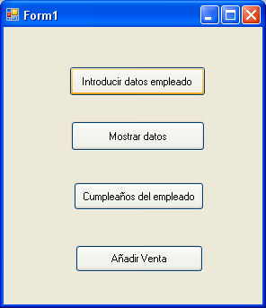

   

<br>
<br>

# Tema 7. Programación Orientada a Objetos

[*1.	Introducción*](#_apartado1)

[*2.	Ejemplo de clase*](#_apartado2)

[*3.	Trabajar con una lista de objetos*](#_apartado3)

[*4.	Lista de objetos en una clase*](#_apartado4)

[*5.	Referencias y utilización de null*](#_apartado5)

<br>

# <a name="_apartado1"></a>1. Introducción.

En este tema vamos a retomar el paradigma de **Programación Orientada a Objetos** que comenzamos a ver en el tema 5.

Para ello vamos a ver en primer lugar el ejemplo de POO que ya teníamos en ese tema 5, que nos va a servir para repasar conceptos que en principio ya conocemos, pero en los que a lo mejor no hemos profundizado.

En ese ejemplo trabajamos con una clase Empleado y vemos los conceptos de **clase, objeto, miembros, métodos, propiedades y constructores**.

Aunque vamos a repasar todos esos conceptos os recomiendo que releáis el tema 5.

A continuación, veremos cómo podemos utilizar las **listas** para ampliar la funcionalidad y también poder trabajar con listas de empleados.
 

<br>
<br>

# <a name="_apartado2"></a>2. Ejemplo de clase.

Vamos a ver a continuación un ejemplo completo en el que se declara una clase empleado, con los miembros de datos, sus propiedades y los métodos tanto públicos como privados.

```csharp
    class Empleado
    {
        // Declaración de miembros de la clase.
        private string _nombre;
        private int _edad;
        // Aquí almacenaremos ventas realizadas por el empleado.
 	  // Utilizamos el tipo List 
        private List<double> _ventas;

        // Propiedades de la clase
        public string Nombre
        {
            get { return _nombre; }
            set { _nombre = value; }
        }

        public int Edad
        {
            get { return _edad; }
            set
            {
             // No permitimos edades negativas o superiores a 100.
                if (value >= 0 && value <= 100)
                {
                    _edad = value;
                }
                else
                {
                     throw new ArgumentOutOfRangeException("La edad debe estar entre 0 y 100.");

                }
            }
        }
        
        // Constructor
        public Empleado()
        {
            _nombre = "";
            _edad = 0;
            // Creamos la lista de ventas.
            _ventas = new List<double>();
        }
        // Métodos de la clase
        // Cumpleaños del empleado
        public void CumpleAnyos()
        {
            _edad = _edad + 1;
        }

        // Añadir una venta al empleado.
        public void AnyadirVenta(double venta)
        {
            if (venta > 0)
                _ventas.Add(venta);
        }


        // Función que devuelve un texto con la lista de ventas
        // Es privada ya que solo se utilizará dentro de la clase 
        // (en mostraDatos)
        private string MostrarVentas()
        {
            string texto;
            int i;

            if (_ventas.Count > 0)
            {
                texto = "Las ventas son: ";
                for (i = 0; i < _ventas.Count; i++)
                    texto = texto + _ventas[i] + ", ";

                texto = texto + "\n";
            }
            else
                texto = "Empleado sin ventas.\n";

            return texto;
        }

    
      // Función que devuelve un texto con los datos del empleado.
      // Es pública ya que se llama desde fuera de la clase
        public string MostrarDatos()
        {
            string texto;

            texto = "Datos del empleado:\n";
            texto = texto + "Nombre: " + _nombre + "\n";
            texto = texto + "Edad: " + _edad + "\n";
            texto = texto + MostrarVentas();

            return texto;
        }
    }

```

<br>

A continuación, vemos como se manejaría esta clase en el formulario. En él creamos una instancia u objeto de la clase: 




```csharp
public partial class Form1 : Form
{
    public Form1()
    {
        InitializeComponent();
    }

    Empleado emp = new Empleado();

    private void btnIntroducir_Click(object sender, EventArgs e)
    {
        try
        {
           emp.Nombre = Interaction.InputBox("Introduzca el nombre del 
                                             empleado.");
           emp.Edad = int.Parse(Interaction.InputBox("Introduzca la edad del 
                                              empleado."));
        }
        catch (Exception ex)
        {
            MessageBox.Show($"Ha saltado la siguiente excepción: 
                            {ex.Message}");
        }
    }

    private void btnMostrar_Click(object sender, EventArgs e)
    {
        MessageBox.Show(emp.MostrarDatos());
    }

    private void btnCumpleanyos_Click(object sender, EventArgs e)
    {
        emp.CumpleAnyos();
    }

    private void btnAnyadirVenta_Click(object sender, EventArgs e)
    {
        double venta;

        venta = double.Parse(Interaction.InputBox("Introduzca la venta: "));
        emp.AnyadirVenta(venta);
    }
}
```

En este código dentro del formulario empezamos a darnos cuenta de la potencialidad de la programacion orientada a objetos y de la **facilidad** con la que podemos utilizar un objeto de una clase en la cual hemos hecho una buena abstracción.

Al encapsular el funcionamiento interno de la clase, el programador que utiliza un **objeto** de la clase `Empleado` únicamente se preocupa de **utilizar los métodos públicos sin necesidad de conocer internamente la clase**.

Por ejemplo, para añadir una venta al empleado sabe que debe llamar al método `emp.anyadirVenta`(venta), **sin preocuparse de cómo se gestionan** internamente esas ventas, si con un vector, con una lista, o si se guardan en una base de datos…

O cuando sea el cumpleaños del empleado simplemente llamamos a `emp.cumpleAnyos()`. Si en el futuro quisiéramos como programadores de la clase aumentar la funcionalidad de ese método cumpleAnyos, lo haríamos en la clase y ese cambio afectaría a todos los objetos.

<br>
<br>

# <a name="_apartado3"></a>3. Trabajar con una lista de objetos.

Imaginemos que a continuación queremos cambiar la funcionalidad del problema, de manera que **trabajemos con una lista de empleados**.

Vamos a crear una lista a la que vayamos añadiendo objetos de tipo empleado:

```csharp

List<Empleado> listaEmp = new List<Empleado>();

private void btnIntroducir_Click(object sender, EventArgs e)
{
    try
    {
        // Creamos un nuevo empleado.
        Empleado emp = new Empleado();
        emp.Nombre = Interaction.InputBox("Introduzca el nombre del empleado.");

        emp.Edad = int.Parse(Interaction.InputBox("Introduzca la edad del empleado."));

        // Lo añadimos a la lista de empleados.
        listaEmp.Add(emp);
    }
    catch (Exception ex)
    {
        MessageBox.Show($"Ha saltado la siguiente excepción: {ex.Message}");
    }
}

private void btnMostrar_Click(object sender, EventArgs e)
{
    int i;
    Empleado emp;
    string texto;

    texto = "Los empleados de la empresa son:\n";
    for (i = 0; i < listaEmp.Count; i++)
    {
        // Asignamos a emp el empleado de la posición i.
        emp = listaEmp[i];
        texto = texto + emp.MostrarDatos();
    }

    MessageBox.Show(texto);
}

private void btnMostrarForEach_Click(object sender, EventArgs e)
{
    string texto;

    texto = "Los empleados de la empresa son:\n";

    foreach(Empleado emp in listaEmp)
    {
        texto += emp.MostrarDatos();
    }

    MessageBox.Show(texto);
}
```

<br>
<hr>
Es interesante notar un par de puntos en el código que acabamos de ver. El primero es que al leer los empleados nuevos hacemos: `emp = new Empleado();`. 

Esto es así porque cada empleado que leemos es nuevo y **necesitamos crearlo** con el constructor `new`. Luego lo añadimos a la lista.

Sin embargo, cuando estamos mostrando los empleados no tenemos que hacer new ya que los empleados ya están creados en el vector. Al hacer `emp = listaEmp[i]`; no estamos copiando el empleado en `emp` sino que **estamos haciendo referencia** al mismo.

Tener en cuenta que los objetos son referencias, es decir, al hacer `emp = listaEmp[i];` lo que estamos haciendo es que `emp` "apunte" al empleado que hay en la posición i.

Si modificáramos el contenido de `emp` se modificaría el contenido del empleado i ya que **son el mismo objeto**.
<hr>

Veámoslo en el siguiente ejemplo. 

Queremos que sea **el cumpleaños de un empleado**. Para ello pedimos su nombre, lo buscamos y a continuación llamamos al método cumpleaños de ese objeto.

```csharp
// Función que devuelve la posición en la que se encuentra
// el empleado con el nombre.
// Si no lo encuentra devuelve -1
private int BuscarEmpleado(List<Empleado> listaEmp, string nombre)
{
    int pos;
    Empleado emp = null;

    pos = -1;
    for (int i = 0; i < listaEmp.Count && pos == -1; i++)
    {
        emp = listaEmp[i];
        if (emp.Nombre == nombre)
        {
            pos = i;
        }
    }

    return pos;
}

private void btnCumpleanyos_Click(object sender, EventArgs e)
{
    int pos;
    Empleado emp;
    string nombre;

    nombre = Interaction.InputBox("Introduzca el nombre del empleado del cumpleaños");
    pos = BuscarEmpleado(listaEmp, nombre);
    if (pos >= 0)
    {
        emp = listaEmp[pos];
        emp.CumpleAnyos();
    }
    else
    {
        MessageBox.Show($"El empleado {nombre} no existe.");
    }
}
```
<br>

También podemos utilizar este enfoque para añadir una venta al empleado que deseemos:

```csharp
private void btnAnyadirVenta_Click(object sender, EventArgs e)
{
    int pos;
    Empleado emp;
    string nombre;

    nombre = Interaction.InputBox("Introduzca el nombre del empleado");
    pos = BuscarEmpleado(listaEmp, nombre);
    if (pos >= 0)
    {
        double venta;
        bool ventaCorrecta = double.TryParse(Interaction.InputBox("Introduzca una venta"),
                                        out venta);

        if (ventaCorrecta)
        {
            emp = listaEmp[pos];
            emp.AnyadirVenta(venta);
        }
        else
        {
            MessageBox.Show("El usuario no ha introducido una venta correcta");
        }
    }
    else
    {
        MessageBox.Show($"El empleado {nombre} no existe.");
    }
}
```

<br>
<br>

# <a name="_apartado4"></a>4. Lista de objetos en una clase.

Vamos a hacer un ejemplo completo, en este caso en Consola, en el que vamos a ir algo más allá en el concepto de POO. 

Nuestro programa será similar al anterior, aunque ahora vamos a trabajar con **los alumnos de una clase**.

Además, **la lista de alumnos la vamos a meter a su vez en una Clase**.

En primer lugar, definimos la clase Alumno:

```csharp
internal class Alumno
{
    // Declaración de miembros y propiedades de la clase.
    public string Nombre { get; set; }  // auto-property: sin lógica adicional

    private int _edad;
    public int Edad
    {
        get { return _edad; }
        set
        {
            // No permitimos edades negativas o superiores a 100.
            if (value >= 0 && value <= 100)
            {
                _edad = value;
            }
            else
            {
                throw new ArgumentOutOfRangeException("La edad debe estar entre 0 y 100.");
            }
        }
    }
    private List<double> _notas = new List<double>();

    // Constructores
    public Alumno()
    {
        Nombre = "";
        _edad = 0;
    }

    // Otro constructor
    public Alumno(string nombre, int edad)
    {
        Nombre = nombre;
        _edad = edad;
    }

    // Métodos de la clase
    // Cumpleaños del alumno
    public void CumpleAnyos()
    {
        _edad = _edad + 1;
    }

    // Añadir una nota al alumno.
    public void AnyadirNota(double nota)
    {
        if (nota >= 0 && nota <= 10)
        {
            _notas.Add(nota);
        }
        else 
        { 
            throw new ArgumentOutOfRangeException($"{nota} no es una nota correcta"); 
        }
    }

    // Función privada. Devuelve un texto con las notas
    private string MostrarNotas()
    {
        string texto;
        int i;
        if (_notas.Count > 0)
        {
            texto = "Notas: ";
            for (i = 0; i < _notas.Count; i++)
            {
                texto += $"{_notas[i]},  ";
            }
            texto += "\n";
        }
        else
        {
            texto = "Alumno sin notas.\n";
        }
        return texto;
    }

    // Función que devuelve un texto con los datos del alumno.
    public string MostrarDatos()
    {
        string texto;
        texto = "Datos del alumno:\n";
        texto += $"Nombre: {Nombre}\n";
        texto += $"Edad: {_edad}\n";
        texto += MostrarNotas();
        
        return texto;
    }
}
```

<br>

Ahora definimos la clase `ListaAlumnos`. Esta clase simplemente tendrá un miembro privado `_lista` en el que tendremos un `List<Alumno>`.

De esa manera pasaremos a esta clase toda la lógica de trabajo con las listas que antes hacíamos en la interfaz.

```csharp
internal class ListaAlumnos
{
    // Declaramos una lista privada
    private List<Alumno> _lista;

    // Constructor de la clase. Creamos la lista.
    public ListaAlumnos()
    {
        _lista = new List<Alumno>();
    }

    // Método que añade un alumno a la lista.
    // Le pasa el nombre y la edad
    public void AnyadirAlumno(string nombre, int edad)
    {

        Alumno alumno = new Alumno();

        alumno.Nombre = nombre;
        alumno.Edad = edad;

        // Podríamos haber sustituido lo anterior por:
        //Alumno alumno = new Alumno(nombre, edad);

        // Añadimos el objeto recién creado a la lista.
        _lista.Add(alumno);
    }

    // Podemos tener dos métodos con el mismo nombre
    // y distintos parámetros
    // En este caso añadimos un objeto de tipo Alumno
    // ya creado
    public void AnyadirAlumno(Alumno alumno)
    {
        _lista.Add(alumno);
    }

    public string MostrarDatosListaAlumnos()
    {
        string texto = "Lista de Alumnos:\n";

        foreach (Alumno alumno in _lista)
        {
            texto += alumno.MostrarDatos();
        }

        return texto;
    }

    public string MostrarNombresListaAlumnos()
    {
        string texto = "Lista de Alumnos:\n";
        int pos = 1;

        foreach (Alumno alumno in _lista)
        {
            texto += $"{pos} - {alumno.Nombre}\n";
            pos++;
        }

        return texto;
    }

    // Método privado que busca por nombre la posicion
    // de un alumno en la lista. -1 si no lo encuentra.
    private int BuscarAlumno(string nombre)
    {
        int pos = -1;
        bool encontrado = false;
                    
        for(int i = 0; i < _lista.Count && !encontrado; i++)
        {
            Alumno alumno;
            alumno = _lista[i];
            if (alumno.Nombre == nombre)
            {
                pos = i;
                encontrado = true;
            }
        }

        return pos;
    }

    // Método que se le pasa el nombre del alumno y la nota.
    // Si lo encuentra le añade esa nota.
    // Devuelve cierto o falso según se haya podido encontrar y añadir la nota.
    public bool AnyadirNotaAlumno(string nombre, double nota)
    {
        int pos;
        Alumno alumno;
        bool encontrado = false;

        pos = BuscarAlumno(nombre);
        if (pos >= 0)
        {
            alumno = _lista[pos];
            alumno.AnyadirNota(nota);
            encontrado = true;
        }

        return encontrado;
    }

    // Método que se le pasa el nombre del alumno.
    // Si lo encuentra llama a su método Cumpleanyos
    // Devuelve cierto si se ha encontrado el alumno
    public bool CumpleanyosAlumno(string nombre)
    {
        int pos;
        Alumno alumno;
        bool encontrado = false;

        pos = BuscarAlumno(nombre);
        if (pos >= 0)
        {
            alumno = _lista[pos];
            alumno.CumpleAnyos();
            encontrado = true;
        }

        return encontrado;
    }

    public string MostrarDatosAlumno(string nombre)
    {
        int pos;
        Alumno alumno;
        string datos = "Alumno no encontrado";

        pos = BuscarAlumno(nombre);
        if (pos >= 0)
        {
            alumno = _lista[pos];
            datos = alumno.MostrarDatos();
        }

        return datos;
    }

    public bool EliminarAlumno(string nombre)
    {
        int pos;
        bool encontrado = false;

        pos = BuscarAlumno(nombre);
        if (pos >= 0)
        {
            _lista.RemoveAt(pos);
            encontrado = true;
        }

        return encontrado;
    }
}
```

En este punto nos encontramos con que ya tenemos definidas las clases con las que vamos a trabajar (`Alumno` y `ListaAlumnos`) y vamos a pasar a trabajar con la interfaz.

En primer lugar, vamos a hacer una **clase estática** que nos va a permitir agrupar todas las **funciones de interfaz**, para leer y mostrar datos, que luego utilizaremos en nuestro programa principal:

```csharp
static class FuncionesInterfaz
{
    //---------------------------
    // Funciones generales
    //---------------------------
    static public int LeerEntero(string mensaje)
    {
        int num;
        bool correcto;

        do
        {
            Console.Write(mensaje);
            // Si lo que leemos no es un entero devuelve false
            correcto = int.TryParse(Console.ReadLine(), out num);

            if (!correcto)
            {
                Console.WriteLine("El texto introducido no es un entero correcto.");
            }

        } while (!correcto);
        // Continuamos pidiendo el número mientras no sea correcto

        return num;
    }

    // Función que lee una nota entre 0 y 10
    static public double LeerNota(string mensaje)
    {
        double nota;
        bool correcto;

        do
        {
            Console.Write(mensaje);
            // Si lo que leemos no es un entero devuelve false
            correcto = double.TryParse(Console.ReadLine(), out nota);

            if (!correcto)
            {
                Console.WriteLine("El texto introducido no es un entero correcto.");
            }
            else
            {
                if(nota < 0 || nota > 10)
                {
                    Console.WriteLine("Introduzca una nota entre 0 y 10.");
                    correcto = false;
                }
            }

        } while (!correcto);
        // Continuamos pidiendo el número mientras no sea correcto

        return nota;
    }

    static public string LeerNombre()
    {
        string nombre;

        Console.Write("Introduzca el nombre:");

        nombre = Console.ReadLine();

        return nombre;
    }

    // Función que muestra un menú de opciones y devuelve la elegida.
    static public int Menu()
    {
        int opc;

        do
        {
            Console.WriteLine("\nMenú.");
            Console.WriteLine("1. Mostrar nombres de los alumnos.");
            Console.WriteLine("2. Introducir nuevo alumno.");
            Console.WriteLine("3. Introducir nuevo alumno con objeto.");
            Console.WriteLine("4. Mostrar datos de un alumno.");
            Console.WriteLine("5. Añadir Nota a un alumno.");
            Console.WriteLine("6. Eliminar un alumno.");
            Console.WriteLine("7. Salir del programa.");

            opc = LeerEntero("\nIntroduzca la opción: ");
        } while (opc < 1 || opc > 7);

        return opc;
    }

    //---------------------------
    // Funciones con la lista de alumnos
    //---------------------------

    // Lee el nombre y la edad y añade alumno
    static public void LeerDatosAlumno(ListaAlumnos listaAlumnos)
    {
        try
        {
            String nombre;
            int edad;

            Console.Write("Introduzca el nombre del alumno: ");
            nombre = Console.ReadLine();
            edad = LeerEntero("Introduzca la edad: ");

            listaAlumnos.AnyadirAlumno(nombre, edad);
        }
        catch (Exception ex)
        {
            Console.WriteLine($"Ha saltado la siguiente excepción: {ex.Message}");
        }
    }

    // Añade un alumno creando el objeto y pasándoselo a listaAlumnos
    static public void LeerDatosAlumnoConObjeto(ListaAlumnos listaAlumnos)
    {
        try
        {
            Alumno alumno = new Alumno();

            Console.Write("Introduzca el nombre del alumno: ");
            alumno.Nombre = Console.ReadLine();
            alumno.Edad = LeerEntero("Introduzca la edad: ");

            listaAlumnos.AnyadirAlumno(alumno);
        }
        catch (Exception ex)
        {
            Console.WriteLine($"Ha saltado la siguiente excepción: {ex.Message}");
        }
    }

    // Pide un nombre y una nota y la añade a ese alumno
    static public void AnyadirNotaAlumno(ListaAlumnos listaAlumnos)
    {
        string nombre = LeerNombre();
        double nota = LeerNota("Introduzca la nota del alumno: ");

        bool encontrado = listaAlumnos.AnyadirNotaAlumno(nombre, nota);

        if (encontrado)
        {
            Console.WriteLine("Se ha añadido correctamente");
        }
        else
        {
            Console.WriteLine($"El alumno {nombre} no se ha encontrado");
        }
    }

    // Rellenamos la lista con una serie de alumnos
    static public void RellenarConDatosEjemplo(ListaAlumnos listaAlumnos)
    {
        listaAlumnos.AnyadirAlumno(new Alumno("Sara", 20));
        listaAlumnos.AnyadirAlumno(new Alumno("Víctor", 30));
        listaAlumnos.AnyadirAlumno(new Alumno("Eva", 33));
        listaAlumnos.AnyadirAlumno(new Alumno("Rafael", 41));
        listaAlumnos.AnyadirAlumno(new Alumno("Manuel", 25));
        listaAlumnos.AnyadirAlumno(new Alumno("María", 32));
        listaAlumnos.AnyadirAlumno(new Alumno("Alicia", 29));
        listaAlumnos.AnyadirAlumno(new Alumno("Daniel", 43));
        listaAlumnos.AnyadirAlumno(new Alumno("Patricia", 36));
    }
}
```

<br>

Y por último nos encontramos nuestro **programa principal**, que simplemente creará un objeto de tipo `ListaAlumnos` e irá llamando a las funciones de interfaz:

```csharp
static void Main(string[] args)
{
    ListaAlumnos listaAlumnos = new ListaAlumnos();

    Interfaz.RellenarConDatosEjemplo(listaAlumnos);

    int opc;

    do
    {
        opc = FuncionesInterfaz.Menu();

        switch (opc)
        {
            case 1:
                Console.WriteLine(listaAlumnos.MostrarNombresListaAlumnos());
                break;
            case 2:
                FuncionesInterfaz.LeerDatosAlumno(listaAlumnos);
                break;
            case 3:
                FuncionesInterfaz.LeerDatosAlumnoConObjeto(listaAlumnos);
                break;
            case 4:
                string nombre = Interfaz.LeerNombre();
                Console.WriteLine();
                Console.WriteLine(listaAlumnos.MostrarDatosAlumno(nombre));                        
                break;
            case 5:
                FuncionesInterfaz.AnyadirNotaAlumno(listaAlumnos);
                break;
            case 6:
                // Eliminar alumno. Por implementar
                break;
        }
    } while (opc != 7);

    Console.WriteLine("Fin del programa.");
}
```


<br>
<br>

# <a name="_apartado5"></a>5. Referencias y utilización de null.

Vamos a ver brevemente el concepto de `null`. 

En POO, `null` representa la ausencia de una referencia a un objeto.

Debemos distinguir entre el **concepto de objeto y de referencia**.

Cuando nosotros escribimos:

```csharp
Alumno alumno;
```

Estamos declarando una referencia a un objeto de tipo `Alumno`, pero al no haber hecho `new`, ese objeto apunta a `null`.

En el momento en que nosotros hacemos `new` sobre esa referencia, pasa a apuntar al objeto creado en memoria:

```csharp
Alumno alumno = new Alumno();
```

Si trabajamos con dos referencias podemos hacer que una "apunte" a la otra:

```csharp
Alumno alumno1 = new Alumno("María", 20);
Alumno alumno2 = new Alumno("Antonio", 30);

Console.WriteLine(alumno1.MostrarDatosAlumno()); // María, 20
Console.WriteLine(alumno2.MostrarDatosAlumno()); // Antonio, 30

alumno2 = alumno1; // La referencia alumno2 apunta al mismo objeto que alumno1

Console.WriteLine(alumno1.MostrarDatosAlumno()); // María, 20
Console.WriteLine(alumno2.MostrarDatosAlumno()); // María, 20
```

Y podemos hacer que una referencia pase a apuntar a `null`

```csharp
alumno2 = null;

Console.WriteLine(alumno2.MostrarDatosAlumno()); 
// Tendríamos un error de ejecución, 
// ya que alumno2 no apunta a ningún objeto
```

Vamos a ver un ejemplo en el que puede ser interesante utilizar `null`.

Imaginemos que en nuestra aplicación de estudiantes queremos hacer un método dentro de `ListaAlumnos` que se le pase el nombre del alumno y nos devuelva ese objeto.

Es un método relativamente sencillo de realizar con lo que tenemos hasta ahora, pero ¿qué pasa si **el nombre no existe** en nuestra lista de alumnos? ¿Qué objeto devolveremos?

Pues en ese caso devolveremos un objeto `null`.

Vamos a verlo. En nuestra clase `ListaAlumnos` añadiremos el siguiente método:

```csharp
    // Método que busca un alumno y devuelve su objeto
    // Si no lo encuentra devuelve null.
    public Alumno DevolverAlumno(string nombre)
    {
        int pos;
        Alumno alumno;

        pos = BuscarAlumno(nombre);
        if (pos >= 0)
        {
            alumno = _lista[pos];

        }
        else
        {
            alumno = null;
        }

        return alumno;
    }
```

A continuación, en nuestra interfaz podemos utilizar ese método para recoger el objeto alumno y hacer con él lo que queramos (por ejemplo, llamar a su método `Cumpleanyos`), pero debemos comprobar antes que el objeto no sea `null`, ya que eso será lo que devuelva si no existe un alumno con ese nombre.

En la clase Interfaz:

```csharp
    static public void CumpleañosDeAlumno(ListaAlumnos listaAlumnos)
    {
        string nombre = Interfaz.LeerNombre();

        Alumno alumno = listaAlumnos.DevolverAlumno(nombre);

        if (alumno != null)
        {
            Console.WriteLine("Feliz cumpleaños");
            alumno.CumpleAnyos();
        }
        else
        {
            Console.WriteLine($"El alumno {nombre} no se ha encontrado");
        }
    }
```

<hr>
**Atención**

A partir de la versión 8.0 de C# para que un objeto sea nullable debemos ponerle `?`:

`Alumno ? alumno`

Por ejemplo, si desarrollamos un proyecto de Windows Forms o de Consola (que no sean .NET Framework).

"Pero eso es otra historia y debe ser contada en otra ocasión".
<hr>
